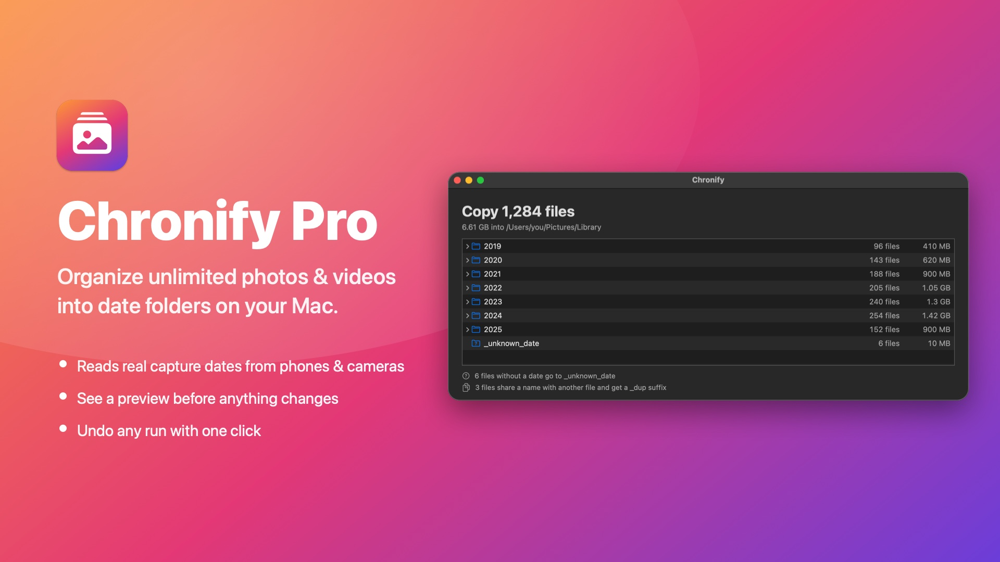
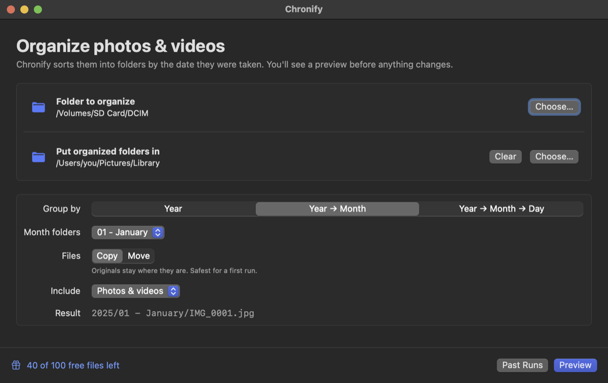
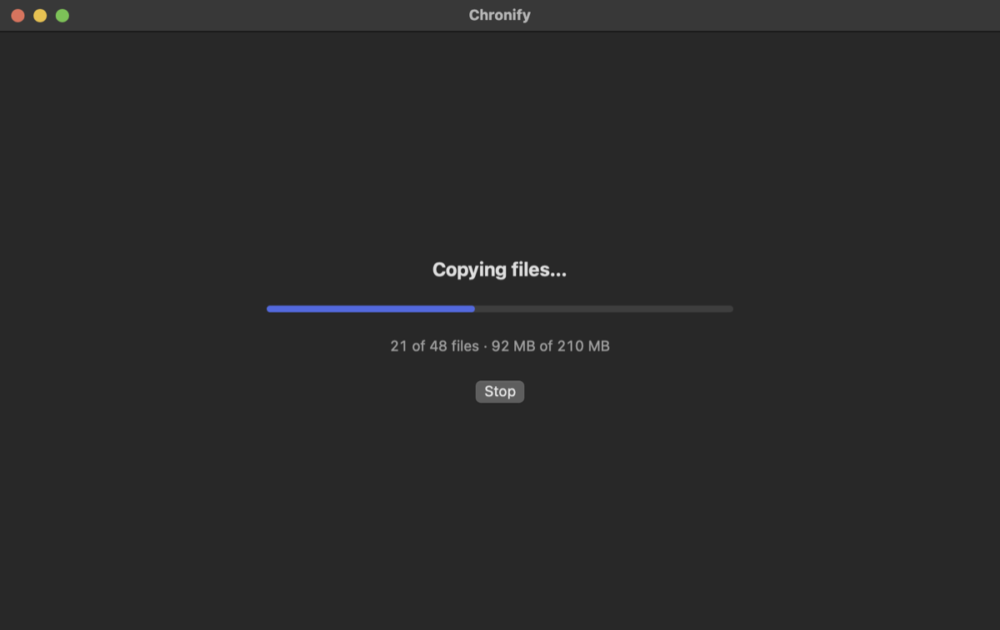
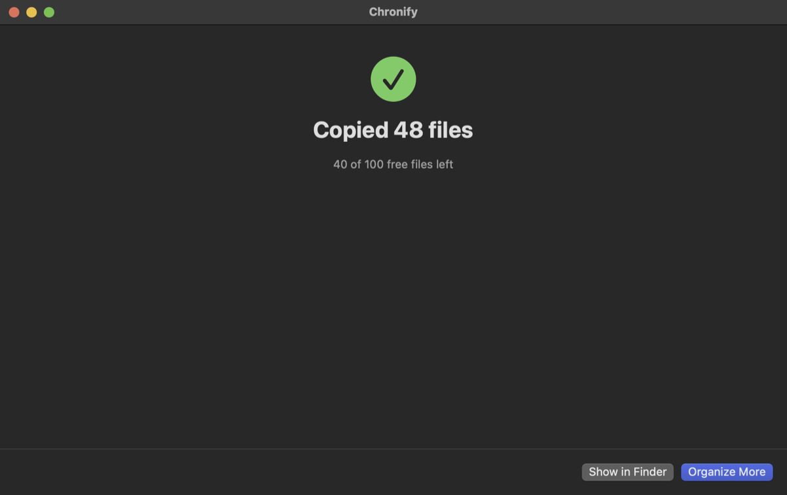

# Chronify

Chronify is a command-line photo and video organizer for large media
libraries. It scans a folder, works out when each photo or video was taken,
and files it into date folders:

```text
Media Library/
  2024/
    05 - May/
      IMG_1234.HEIC
      IMG_1235.MOV
  _unknown_date/
    scan-without-date.png
```

It is built for large collections, external drives, and cautious migrations:
it always shows a preview first, asks before changing anything, and every run
can be undone.

**Two ways to use it:**

| | Chronify CLI | Chronify for Mac |
| --- | --- | --- |
| For | The terminal, scripts, servers | Anyone who prefers a window |
| Platforms | macOS, Linux, Windows | macOS 14 or newer |
| Price | Free and open source, unlimited | Free for 100 files, then Chronify Pro (€1/month) |
| Get it | [Install below](#installation) | [Download from Releases](https://github.com/thatbackendguy/chronify/releases/latest) |

Both use the same engine, so they organize files exactly the same way.

## Features

- Choose your layout: by **year**, **year → month**, or **year → month → day**
- Month folders named the way you like: `01 - January`, `01-Jan`, `01`,
  `January` or `Jan`
- Guided setup: run `chronify` with no arguments and answer a few questions
- Preview of where files will go, then a `[y/N]` confirmation
- Live progress bar with ETA
- **Undo** any run from its CSV manifest
- Reads the capture date stored inside photos and videos with no extra tools,
  so `IMG_1234.HEIC` or `IMG_1234.MOV` (no date in the name) still land in the
  right folder
- Understands camera, phone, screenshot and WhatsApp-style filename dates
- Safe file handling: existing files are never overwritten, copies are written
  to a temp file before being renamed into place, and moves between drives are
  verified before the original is deleted
- Ctrl+C stops cleanly after the current file and keeps the manifest accurate
- No runtime dependencies; a single binary for macOS, Linux and Windows

## Chronify for Mac



Prefer a window to the terminal? **Chronify for Mac** is a native app with the
same engine: pick a folder (or drop one in), check the preview, organize, and
undo with a click.

| Choose folders and layout | Organize with progress | Done, with undo |
| --- | --- | --- |
|  |  |  |

**Get it:** download `Chronify-<version>.dmg` from the
[latest release](https://github.com/thatbackendguy/chronify/releases/latest),
open it and drag **Chronify** to **Applications**. Requires macOS 14 or newer
(Apple Silicon or Intel).

**Pricing:** previews and undo are always free, and the first 100 files you
organize are free. **Chronify Pro** (€1/month) removes the limit; subscribe
from inside the app. The command-line tool stays free and unlimited.

The Mac app is distributed as a download only; its source code is not part
of this repository.

## Installation

### Option 1: download a prebuilt binary (no Go needed)

1. Open the [latest release](https://github.com/thatbackendguy/chronify/releases/latest)
   and download the archive for your system:

   | System | File |
   | --- | --- |
   | macOS, Apple Silicon (M1 and newer) | `chronify_<version>_darwin_arm64.tar.gz` |
   | macOS, Intel | `chronify_<version>_darwin_amd64.tar.gz` |
   | Linux, x86-64 | `chronify_<version>_linux_amd64.tar.gz` |
   | Linux, ARM64 (e.g. Raspberry Pi 4/5) | `chronify_<version>_linux_arm64.tar.gz` |
   | Windows, x86-64 | `chronify_<version>_windows_amd64.zip` |
   | Windows, ARM64 | `chronify_<version>_windows_arm64.zip` |

2. Extract it and move the binary onto your `PATH`. On macOS and Linux:

   ```bash
   tar -xzf chronify_*_darwin_arm64.tar.gz
   sudo mv chronify_*/chronify /usr/local/bin/
   ```

   On Windows, extract the zip and put `chronify.exe` in a folder on your
   `PATH` (or run it from the extracted folder).

3. **macOS only:** the binary isn't notarized by Apple, so the first launch is
   blocked with "cannot be opened". Clear the download flag once:

   ```bash
   xattr -d com.apple.quarantine /usr/local/bin/chronify
   ```

Optionally verify the download against `checksums.txt` from the same release:
`shasum -a 256 -c checksums.txt --ignore-missing`.

### Option 2: install with Go

You need **Go 1.21 or newer** ([download](https://go.dev/dl/)); check with
`go version`.

```bash
go install github.com/thatbackendguy/chronify@latest
```

This puts the `chronify` binary in Go's bin folder (`~/go/bin` on macOS and
Linux, `%USERPROFILE%\go\bin` on Windows). If `chronify` is not found
afterwards, add that folder to your `PATH`:

```bash
echo 'export PATH="$PATH:$HOME/go/bin"' >> ~/.zshrc && source ~/.zshrc
```

(Use `~/.bashrc` if your shell is bash.)

### Option 3: build from source

```bash
git clone https://github.com/thatbackendguy/chronify.git
cd chronify
go build -o chronify .
```

This creates `./chronify` (`chronify.exe` on Windows) in the project folder.
Run it as `./chronify`, or move it somewhere on your `PATH`, for example:

```bash
sudo mv chronify /usr/local/bin/
```

Check that it works:

```bash
chronify -version
```

## Your first run

### The easy way: guided setup

Run Chronify with no arguments:

```bash
chronify
```

It asks, one step at a time:

1. Which folder to organize (you can drag a folder into the terminal)
2. Where the organized folders should go
3. How to group files: by year, year → month, or year → month → day
4. How to name month folders
5. Copy or move
6. Photos, videos, or both

It then shows a preview and asks before doing anything. At the end it prints
the equivalent command so you can repeat it later without the questions.

### Step by step with commands

**1. Preview.** Nothing is changed. Chronify shows where every file would go
and writes a CSV manifest you can open in a spreadsheet:

```bash
chronify ~/Pictures/import ~/Pictures/library
```

```text
Preview
  Move 1,284 files (6.2 GB) into /Users/you/Pictures/library

  2023/            412 files  1.9 GB
    07 - July/     240 files  1.1 GB
    08 - August/   172 files  0.8 GB
  2024/            872 files  4.3 GB
    01 - January/  872 files  4.3 GB
```

**2. Copy for your first real run.** Your originals stay where they are until
you're happy with the result:

```bash
chronify -apply -mode copy ~/Pictures/import ~/Pictures/library
```

Chronify shows the preview again and asks `Copy 1,284 files (6.2 GB)? [y/N]`.

**3. Move once you trust it.** Move is the default when `-apply` is given:

```bash
chronify -apply ~/Pictures/import ~/Pictures/library
```

**4. Changed your mind?** Every applied run prints its undo command:

```bash
chronify -undo organizer-report-20250101-120000.csv -apply
```

> **Tips**
> - Put flags **before** the folder names: `chronify -by year SRC DEST`,
>   not `chronify SRC DEST -by year`.
> - Quote paths with spaces: `"/Volumes/SD Card"`.
> - If you leave out `DEST`, the source folder is organized in place.
> - In scripts or scheduled jobs, add `-yes` to skip the confirmation prompt.

## Choosing a layout

| Flags | Result |
| --- | --- |
| `-by year` | `2025/IMG_0001.jpg` |
| `-by month` (default) | `2025/01 - January/IMG_0001.jpg` |
| `-by day` | `2025/01 - January/15/IMG_0001.jpg` |
| `-month-format number-long` (default) | `2025/01 - January/` |
| `-month-format number-short` | `2025/01-Jan/` |
| `-month-format number` | `2025/01/` |
| `-month-format long` | `2025/January/` |
| `-month-format short` | `2025/Jan/` |

Examples:

```bash
chronify -by year ~/Pictures/import ~/Pictures/library
chronify -month-format short ~/Pictures/import ~/Pictures/library
chronify -by day -media videos ~/Movies/import ~/Movies/library
```

The `number-*` formats sort chronologically in Finder and Explorer. `long` and
`short` sort alphabetically (April, August, December…).

> **Upgrading from an earlier version?** Chronify used to create `2025/01`
> folders. To keep adding to a library organized that way, pass
> `-month-format number`.

## Undo

Every applied run writes a CSV manifest (`organizer-report-<date>.csv` in the
current folder unless you set `-report`), and the summary prints the command
to reverse it:

```bash
chronify -undo organizer-report-20250101-120000.csv          # preview
chronify -undo organizer-report-20250101-120000.csv -apply   # do it
```

- Moved files are moved back to their original folders.
- Copies are deleted, but only while the original still exists and the copy
  is unchanged (same size).
- Files that were changed, moved again, or whose original location is now
  taken are skipped and listed.
- Date folders left empty are removed.

Keep the manifest if you might want to undo later. A run with `-report none`
cannot be undone.

## All flags

```text
-by              year, month, or day (default month)
-month-format    number-long, number-short, number, long, or short
-apply           actually move/copy files; omitted means preview only
-mode            move or copy when -apply is set (default move)
-yes             skip the confirmation prompt
-undo FILE       reverse a previous run using its CSV manifest
-media           all, images, or videos
-metadata        auto (built-in + external tools), native (built-in only), or never
-modtime         use filesystem modified time as a last resort (default true)
-unknown-dir     folder for files with no usable date (default _unknown_date)
-conflict        rename or skip when a file with the same name exists
-report          CSV manifest path, or "none"
-verbose         list every file and the full month preview
-interactive     start the guided setup even when flags are given
-include-hidden  include dot-prefixed files and folders
-no-color        plain output (NO_COLOR is also honored)
-workers         parallel date-detection workers
-min-year        minimum accepted media year (default 1900)
-max-year        maximum accepted media year (default next year)
-version         print the version
-json            print machine-readable JSON events instead of text (for apps)
-max-files N     refuse to apply a run larger than N files (-1 = no limit)
```

Run `chronify -h` for the full help text.

## How dates are found

Chronify tries these in order and uses the first date it finds:

1. **Metadata stored inside the file**, read by Chronify itself (see below)
2. **Optional external tools** when `-metadata auto` is set: `ffprobe`,
   `exiftool`, and macOS Spotlight. Spotlight dates are used only when they
   come from the file's contents, not the date the file was copied.
3. **The filename**, such as `IMG_20250204_223211.jpg`,
   `PXL_20231203_092312345.MP.jpg`, `2024-05-09.png`, and `2024.05.mov`
4. **The file's modified time**, unless `-modtime=false`
5. Otherwise the file goes to `_unknown_date/`

Video timestamps stored in UTC are converted to your local timezone, so a clip
from 23:30 on New Year's Eve stays in December. Photo dates use the camera's
own local time.

### Built-in metadata readers

| Format | Date it reads |
| --- | --- |
| JPEG, TIFF, DNG, CR2, NEF, ARW, RW2, ORF, PEF, SRW… | Exif `DateTimeOriginal` |
| HEIC / HEIF / AVIF (iPhone and modern Android photos) | Exif `DateTimeOriginal` |
| Canon CR3 | Exif `DateTimeOriginal` |
| Fujifilm RAF | Exif in the embedded JPEG |
| PNG, WebP | Exif and text date chunks |
| MP4, MOV, M4V, 3GP (phone and camera videos) | Apple `creationdate` (local time), `©day`, then the movie header time |
| AVI | `IDIT` / `ICRD` recording date |
| MKV, WebM | `DateUTC` |

The readers only touch the few bytes that hold dates, so even multi-GB videos
are fast.

### Optional metadata tools

Nothing else is required. If these tools are installed, `-metadata auto` also
uses them, which helps with formats the built-in readers don't cover (for
example AVCHD `.mts` camcorder files):

- [`exiftool`](https://exiftool.org/): broad image and video support
  (`brew install exiftool`, `sudo apt install libimage-exiftool-perl`)
- [`ffprobe`](https://ffmpeg.org/) (part of FFmpeg): video timestamps
  (`brew install ffmpeg`, `sudo apt install ffmpeg`)
- `mdls`: built into macOS

## What gets skipped

- Hidden files and folders (dot-prefixed), including macOS `._*` files on
  exFAT drives; use `-include-hidden` to include them
- NAS and OS system folders such as `@eaDir`, `#recycle`, `$RECYCLE.BIN` and
  `System Volume Information`
- Symlinks, and the destination folder when it is inside the source
- Non-media files (documents, sidecars and so on) are left where they are

## Troubleshooting

- **`chronify: command not found`**: Go's bin folder is not on your `PATH`;
  see [Installation](#installation), or run `./chronify` from the build folder.
- **"Operation not permitted" on macOS** when reading an external drive,
  Desktop or Photos folder: give your terminal app access in **System
  Settings → Privacy & Security → Full Disk Access**.
- **"refusing to … without confirmation"**: input is not a terminal (for
  example in a script or cron job); add `-yes`.
- **Files land in the wrong month**: check the `date_source` column in the CSV
  manifest to see where each date came from. Installing `exiftool` helps for
  unusual formats.
- **Too many files in `_unknown_date/`**: these have no date inside them or in
  their name. The default `-modtime=true` uses the file's modified time instead.

## Exit codes

| Code | Meaning |
| --- | --- |
| 0 | Success (or a preview) |
| 1 | Some files failed, or an error occurred |
| 2 | Invalid flags |
| 130 | Interrupted with Ctrl+C |

## Development

```bash
go test ./...      # run the tests
go vet ./...       # static checks
go build -o chronify .
```

### Making a release

Releases are built by GitHub Actions
([`.github/workflows/release.yml`](.github/workflows/release.yml)). Push a
version tag and the workflow runs the tests, builds binaries for macOS,
Linux and Windows (amd64 and arm64), and publishes them with checksums as a
GitHub Release:

```bash
git tag -a v1.1.0 -m "Chronify v1.1.0"
git push origin v1.1.0
```

To build the same archives locally (into `dist/`):

```bash
scripts/build-release.sh v1.1.0
```

## License

MIT License © [ThatBackendGuy](https://github.com/thatbackendguy/)
